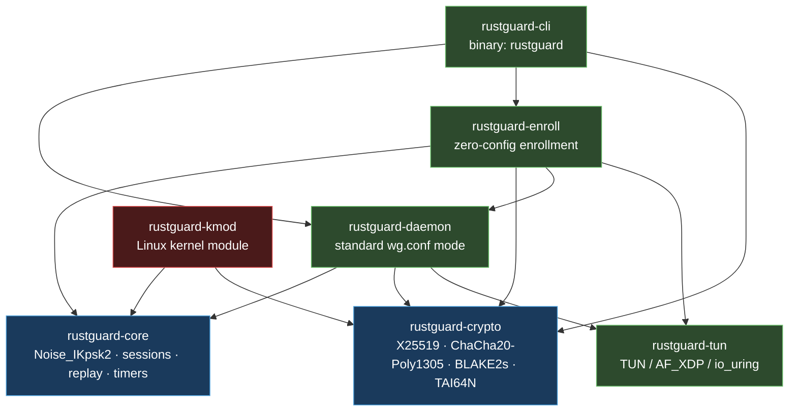
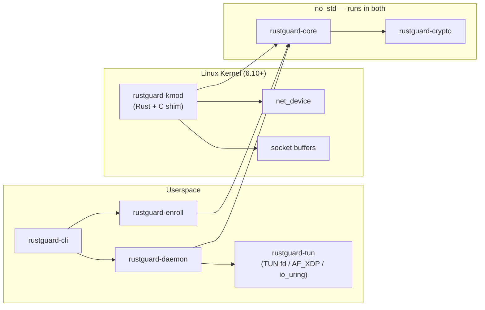

# System Overview

> A high-level map of RustGuard's seven crates, their responsibilities, and how they compose into a complete WireGuard implementation.

## Overview

RustGuard is a clean-room WireGuard implementation in Rust spanning two execution environments: a cross-platform userspace daemon and an out-of-tree Linux kernel module. The codebase is organized into seven crates arranged in strict dependency layers — cryptographic primitives at the base, protocol logic above that, then I/O abstractions and application-level concerns at the top.

The `no_std`-compatible boundary between `rustguard-crypto` and `rustguard-core` is a deliberate architectural constraint: the same protocol code that runs in the userspace daemon is linked into the kernel module without modification.

## Crate Inventory

| Crate | LOC (approx.) | Execution Environment | `no_std` |
|---|---|---|---|
| `rustguard-crypto` | ~400 | userspace + kernel | ✓ |
| `rustguard-core` | ~900 | userspace + kernel | ✓ |
| `rustguard-tun` | ~700 | userspace (Linux + macOS) | ✗ |
| `rustguard-daemon` | ~500 | userspace | ✗ |
| `rustguard-enroll` | ~800 | userspace | ✗ |
| `rustguard-cli` | ~270 | userspace (binary) | ✗ |
| `rustguard-kmod` | ~600 | Linux kernel 6.10+ | ✓ (Rust) |

## Dependency Graph



**Blue** crates are `no_std`-compatible (run in both userspace and kernel). **Green** crates require the standard library. **Red** is the kernel module.

## Component Responsibilities

### `rustguard-crypto`

The cryptographic foundation. Implements all primitives required by the WireGuard specification from scratch — no `libwg` dependency:

- **X25519** — Diffie-Hellman key exchange via `x25519-dalek`. Exposes `StaticSecret`, `PublicKey`, `SharedSecret`, `EphemeralSecret`.
- **ChaCha20-Poly1305** — AEAD encryption via `chacha20poly1305`. `seal`/`open` for standard 96-bit nonces; `xseal`/`xopen` for XChaCha20 (used in cookie encryption and enrollment).
- **HMAC-BLAKE2s** — RFC 2104 double-hash construction (not keyed BLAKE2s). Provides `hash`, `mac`, and `hkdf`.
- **TAI64N** — Timestamp type for handshake anti-replay (`Tai64n`).
- **Protocol constants** — `CONSTRUCTION`, `IDENTIFIER`, `LABEL_MAC1`, `LABEL_COOKIE`.

### `rustguard-core`

The WireGuard protocol layer. Consumes `rustguard-crypto` and implements:

- **`handshake`** — Noise_IKpsk2 three-message exchange (initiation → response → transport key derivation).
- **`session`** — Transport session management including send/receive counter tracking and nonce exhaustion handling.
- **`replay`** — 2048-bit sliding window with split `check()`/`update()` API. The window is checked before AEAD decryption and advanced only on success.
- **`cookie`** — `CookieChecker` (server-side, rotating secrets) and `CookieState` (client-side). Implements WireGuard's DoS mitigation: MAC1 always, MAC2 required under load.
- **`timers`** — State machine for rekey (120 s or 2⁶⁰ messages), keepalive, handshake retry with jitter, and session expiry.
- **`messages`** — Wire-format types for message types 1 (Initiation), 2 (Response), and 3 (Cookie Reply).

### `rustguard-tun`

Platform I/O abstraction. Exposes a unified `Tun` interface and multiple high-performance backends:

| Backend | Module | Description |
|---|---|---|
| macOS `utun` | `macos` | PF_SYSTEM / SYSPROTO_CONTROL kernel socket |
| Linux TUN | `linux` | `/dev/net/tun` with `IFF_TUN \| IFF_NO_PI` |
| Multi-queue TUN | `linux_mq` | `IFF_MULTI_QUEUE` for parallel I/O |
| io_uring | `uring` | Asynchronous batched reads/writes |
| AF_XDP | `xdp` | Zero-copy kernel-bypass via XDP sockets |
| BPF loader | `bpf_loader` | Loads `bpf/xdp_wg.o` for AF_XDP path |

### `rustguard-daemon`

Standard-mode tunnel. Parses `wg.conf` files (`config` module), manages per-peer sessions (`peer` module), and runs the tunnel loop (`tunnel` module). The tunnel loop drives: TUN read → encrypt → UDP send and UDP recv → decrypt → TUN write. Handles `SIGINT`/`SIGTERM` for clean shutdown with route cleanup.

Entry point: `rustguard_daemon::tunnel::run(config: Config)`.

### `rustguard-enroll`

Zero-config enrollment protocol. Eliminates manual key exchange and IP assignment:

- **`server`** / **`client`** — Token-derived XChaCha20-Poly1305 key exchange; server assigns IPs from a CIDR pool.
- **`pool`** — CIDR-based sequential IP allocator (server gets `.1`, clients get subsequent addresses).
- **`control`** — UNIX domain socket interface for runtime `OPEN`/`CLOSE`/`STATUS` commands.
- **`state`** — Peer keys and assigned IPs persisted to `~/.rustguard/state.json`.
- **`protocol`** / **`packet`** — Enrollment message types and serialization.
- **`fast_udp`** — Enrollment datagram I/O.

### `rustguard-cli`

The `rustguard` binary. Parses arguments and dispatches to library crates:

```
up <config>                          → rustguard_daemon::tunnel::run
serve --pool <cidr> --token <token>  → rustguard_enroll::server::run
join <endpoint> --token <token>      → rustguard_enroll::client::run
open [seconds]                       → rustguard_enroll::control::send_command("OPEN …")
close                                → rustguard_enroll::control::send_command("CLOSE")
status                               → rustguard_enroll::control::send_command("STATUS")
genkey                               → rustguard_crypto::StaticSecret::random
pubkey                               → rustguard_crypto::StaticSecret::from_bytes + .public_key()
```

### `rustguard-kmod`

Out-of-tree Linux kernel module targeting 6.10+. Links `rustguard-core` and `rustguard-crypto` in `no_std` mode for Rust protocol logic. A C shim (`wg_net.c`, `wg_queue.c`, `wg_crypto.c`, `wg_socket.c`, `wg_timer.c`, `wg_genl.c`) bridges to Linux kernel APIs — netdevice, socket buffers, workqueues, and Generic Netlink — eliminating the TUN context-switch overhead entirely.

## Execution Environments



## Examples

Generating a key pair from the CLI (delegates to `rustguard_crypto`):

```bash
# Generate a private key
rustguard genkey
# Example output: wFt7QxB6pAqO3LKNRm5Xvz8fUJDiE1sYcbTnMoGhHlw=

# Derive the corresponding public key
echo "wFt7QxB6pAqO3LKNRm5Xvz8fUJDiE1sYcbTnMoGhHlw=" | rustguard pubkey
# Example output: 3UhfXkz9YeN2pQwVbLcJRosDmT1AiBq5HgCxuOdMFvE=
```

Starting the enrollment server with the AF_XDP fast path and a 30-second pairing window:

```bash
# Start server with zero-copy XDP backend, open enrollment immediately
rustguard serve \
  --pool 10.150.0.0/24 \
  --token mysecret \
  --xdp enp7s0 \
  --open

# From another host: enroll as a peer
rustguard join 192.168.99.1:51820 --token mysecret

# On the server: close the pairing window
rustguard close
```

Bringing up a standard tunnel from a `wg.conf` file:

```bash
rustguard up /etc/rustguard/wg0.conf
```

Using the core protocol types directly from Rust:

```rust
use rustguard_core::{handshake, session, replay};
use rustguard_crypto::{StaticSecret, PublicKey};

// Generate local keypair
let local_static = StaticSecret::random();
let local_public = local_static.public_key();

// Initiate a Noise_IKpsk2 handshake toward a peer
let peer_public = PublicKey::from_bytes(peer_pubkey_bytes);
let (init_msg, handshake_state) = handshake::initiate(
    &local_static,
    &local_public,
    &peer_public,
    None, // no PSK
)?;
```

## See Also

- [Core Concepts](02-Architecture/02-Core-Concepts.md) — Glossary of cryptographic and protocol terms used throughout the codebase.
- [Data Flow](02-Architecture/03-Data-Flow.md) — End-to-end traces for transport encryption, handshake, and enrollment.
- [Design Decisions](02-Architecture/04-Design-Decisions.md) — Architecture Decision Records covering security-critical design choices.
- [Package Overview](00-Monorepo/01-Package-Overview.md) — Crate inventory with build targets and feature flags.
- [Dependency Graph](00-Monorepo/02-Dependency-Graph.md) — Full inter-crate dependency matrix and build order.
- [rustguard-crypto](05-Modules/12-rustguard-crypto.md) — Module-level reference for cryptographic primitives.
- [rustguard-core](05-Modules/11-rustguard-core.md) — Module-level reference for protocol implementation.
- [rustguard-tun](05-Modules/07-rustguard-tun.md) — Module-level reference for TUN backends.
- [rustguard-cli](05-Modules/10-rustguard-cli.md) — Module-level reference for the CLI binary.