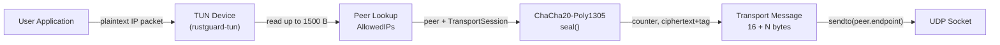
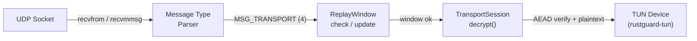
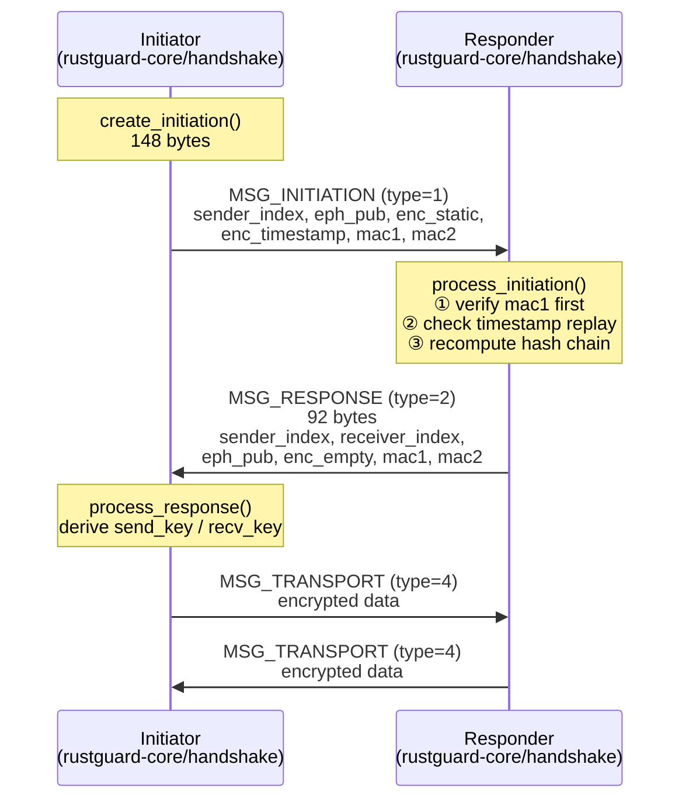
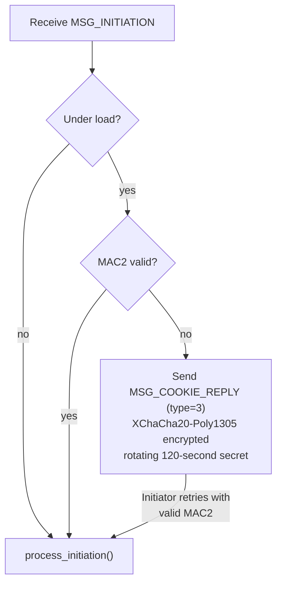
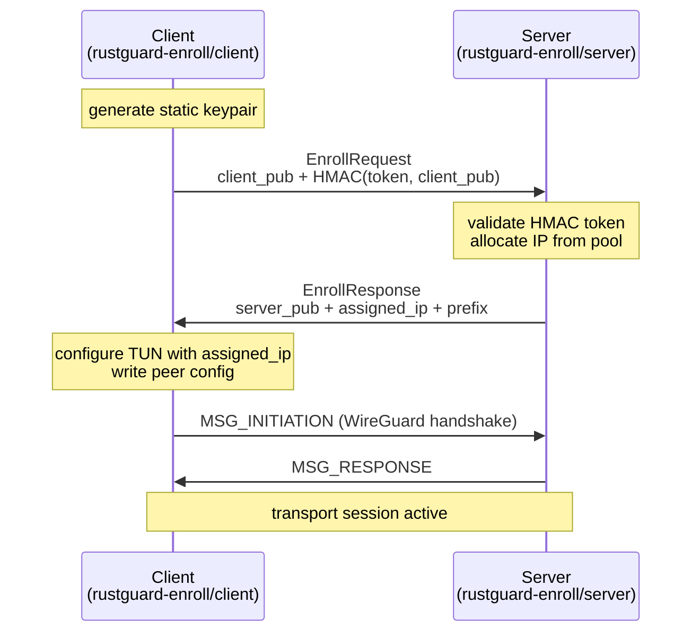
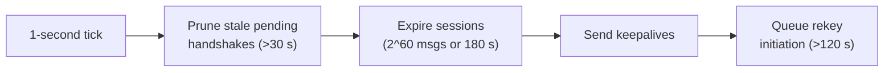

# Data Flow

> Traces how packets, handshake messages, and enrollment requests move through RustGuard's crates and threads.

## Overview

RustGuard processes three distinct classes of data: **transport packets** (encrypted IP traffic), **handshake messages** (Noise_IKpsk2 key exchange), and **enrollment messages** (zero-config peer provisioning). Each path touches a different subset of the crate hierarchy: `rustguard-crypto` → `rustguard-core` → `rustguard-tun` / `rustguard-daemon` / `rustguard-enroll`.

The daemon runs three concurrent threads per tunnel: an outbound thread (TUN → UDP), an inbound thread (UDP → TUN), and a timer thread. The server mode in `rustguard-enroll` replaces the daemon's tunnel loop with a multi-queue, batched variant.

## Transport Packet Flow

### Outbound: TUN → UDP



1. The outbound thread reads a raw IP packet from the TUN file descriptor (up to 1500 bytes).
2. The destination address (byte offset 16 for IPv4, byte offset 24 for IPv6) is inspected to find the matching peer via the `AllowedIPs` table.
3. `TransportSession::encrypt()` increments `send_counter`, constructs a 12-byte nonce (`[0x00; 4] || counter.to_le_bytes()`), and calls `seal()` from `rustguard-crypto`. The output is the plaintext length plus a 16-byte Poly1305 authentication tag.
4. A `MSG_TRANSPORT` (type `4`) wire message is assembled: 4-byte type, 4-byte `their_index`, 8-byte counter (little-endian), ciphertext.
5. The datagram is sent to `peer.endpoint` over the UDP socket.

### Inbound: UDP → TUN



1. The inbound thread calls `recvfrom` (daemon) or `recvmmsg` in batches of up to 32 (server mode) to read UDP datagrams.
2. The first 4 bytes determine the message type. `MSG_TRANSPORT` (`0x04000000` little-endian) routes to the decrypt path; `MSG_INITIATION` and `MSG_RESPONSE` route to the handshake path (see below).
3. `receiver_index` (bytes 4–8) identifies the `TransportSession`. `ReplayWindow::check(counter)` validates the 64-bit counter against a 2048-bit sliding bitmap. Packets that are too old (≥ 2048 behind the high-water mark) or already seen are dropped before any decryption.
4. `TransportSession::decrypt()` calls `open()` from `rustguard-crypto`. If Poly1305 authentication fails, `None` is returned and the packet is silently discarded.
5. On success, `ReplayWindow::update(counter)` marks the counter as seen, and the plaintext is written to the TUN device.

## Handshake Flow

RustGuard implements **Noise_IKpsk2**: one round-trip, mutual authentication, forward secrecy.



### Initiation (148 bytes)

`create_initiation()` in `rustguard-core` builds the Noise_IK hash chain:

| Offset | Field | Size |
|--------|-------|------|
| 0 | type = `0x01000000` | 4 B |
| 4 | `sender_index` (random u32) | 4 B |
| 8 | ephemeral public key | 32 B |
| 40 | `encrypt_and_hash(key, h, our_static_pub)` | 48 B |
| 88 | `encrypt_and_hash(key2, h, tai64n_timestamp)` | 28 B |
| 116 | MAC1 = BLAKE2s-MAC(BLAKE2s(LABEL_MAC1 ‖ responder_pub), msg) | 16 B |
| 132 | MAC2 (cookie; zeros when not under load) | 16 B |

MAC1 is computed over the first 116 bytes. The responder verifies MAC1 **before** any DH operation to prevent unauthenticated CPU burn.

### Response (92 bytes)

`process_initiation()` recomputes the full hash chain (two DH operations), builds a response ephemeral, performs two more DH operations, applies the PSK mixing step, and encrypts an empty payload. Transport keys are derived with HKDF:

```text
(recv_key, send_key, _) = hkdf(ck, [])
```

Note: key assignment is symmetric — the initiator's `send_key` equals the responder's `recv_key`.

### Key Zeroization

After key derivation, all intermediate state (`chaining_key`, `hash`, PSK buffer, `EphemeralSecret`, `SharedSecret`) is zeroized on drop via `ZeroizeOnDrop`. Static secrets use `subtle::ConstantTimeEq` for comparisons.

## Cookie / DoS Protection Flow

When the responder is under load, it issues a Cookie Reply instead of processing initiations:



`CookieChecker` (responder) and `CookieState` (initiator) live in `rustguard-daemon/src/cookie.rs`. The rotating server secret regenerates every 120 seconds; MAC1 is always validated regardless of load state.

## Enrollment Flow

`rustguard-enroll` implements a separate enrollment protocol that runs **before** the WireGuard handshake:



- The server allocates `.1` for itself; clients receive sequential IPs within the CIDR pool.
- Enrollment state (peer keys, assigned IPs) is persisted to `~/.rustguard/state.json` and survives restarts.
- Enrollment is gated by a time-bounded window opened with `rustguard open <seconds>` via a UNIX domain control socket. Existing sessions are unaffected when the window closes.

## Timer Thread

The timer thread fires every 1 second and handles session lifecycle independently of the packet threads:



Rekey initiations use CSPRNG-derived sender indices (replacing the earlier nanosecond-clock approach fixed in commit 2).

## Examples

End-to-end packet trace for a `10.0.0.1 → 10.0.0.2` ICMP packet after session establishment:

```typescript
// Pseudocode tracing rustguard-daemon outbound thread logic

// 1. TUN read
let pkt: &[u8] = tun.read()?;         // raw IPv4 bytes, e.g. 64 bytes

// 2. Peer lookup by destination IP
let dst = Ipv4Addr::from([pkt[16], pkt[17], pkt[18], pkt[19]]);
let peer = allowed_ips.lookup(dst)?;   // finds peer with AllowedIP 10.0.0.2/32

// 3. Encrypt with active TransportSession
let session = peer.session.lock();
let (counter, ciphertext) = session.encrypt(pkt);
// ciphertext.len() == pkt.len() + 16  (Poly1305 tag)

// 4. Assemble MSG_TRANSPORT wire message
// [type=4 u32 LE][their_index u32 LE][counter u64 LE][ciphertext...]

// 5. Send
udp_socket.send_to(&wire_msg, peer.endpoint)?;
```

Corresponding decrypt on the remote peer:

```rust
// rustguard-core TransportSession::decrypt() — simplified
pub fn decrypt(&mut self, counter: u64, ciphertext: &[u8]) -> Option<Vec<u8>> {
    // Replay check before any crypto
    if !self.recv_window.check(counter) {
        return None;
    }
    // ChaCha20-Poly1305 open; nonce = [0,0,0,0] || counter.to_le_bytes()
    let plaintext = open(&self.key_recv, counter, &[], ciphertext)?;
    // Mark seen only after successful authentication
    self.recv_window.update(counter);
    Some(plaintext)
}
```

## See Also

- [System Overview](02-Architecture/01-System-Overview.md) — component responsibilities and top-level diagram
- [Core Concepts](02-Architecture/02-Core-Concepts.md) — glossary of domain terms used on this page
- [Design Decisions](02-Architecture/04-Design-Decisions.md) — rationale for the three-thread model, recvmmsg batching, and replay window size
- [rustguard-core](05-Modules/11-rustguard-core.md) — handshake and session API reference
- [rustguard-crypto](05-Modules/12-rustguard-crypto.md) — `seal`, `open`, `hkdf`, and `ReplayWindow` signatures
- [rustguard-tun](05-Modules/07-rustguard-tun.md) — TUN device abstraction, multi-queue, AF_XDP, and io_uring paths
- [rustguard-enroll](05-Modules/14-rustguard-enroll.md) — enrollment protocol details and IP pool allocator
- [Common Workflows](03-Guides/01-Common-Workflows.md) — `rustguard serve`, `join`, `open`, and `close` end-to-end examples